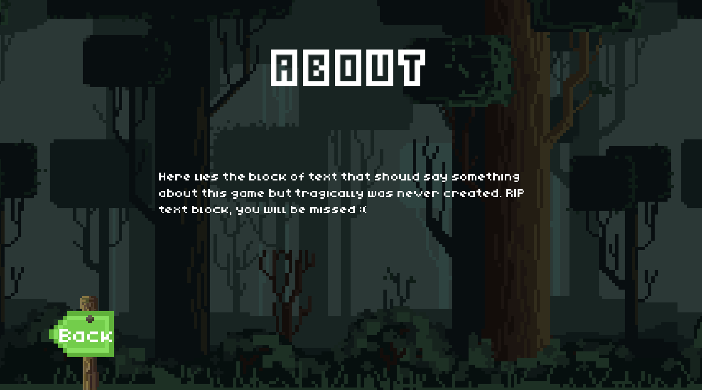
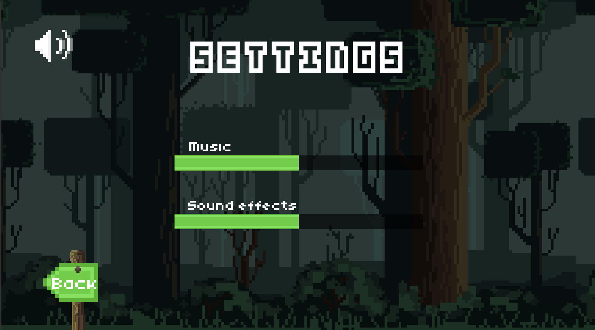
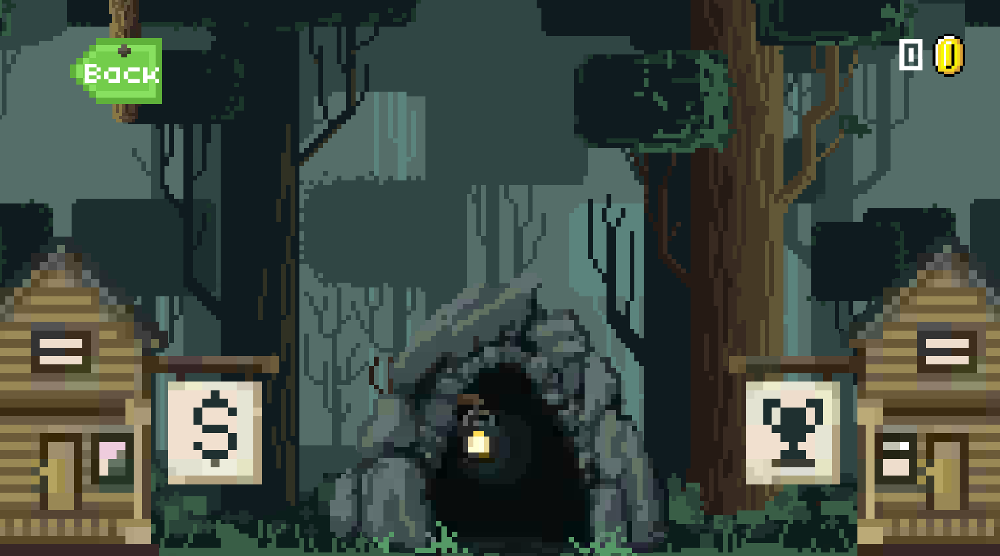
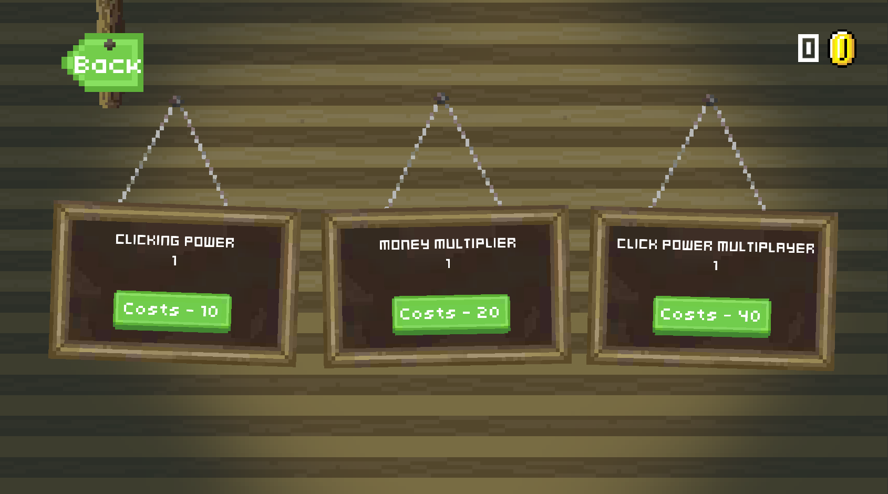

 

[](https://unity3d.com/get-unity/download/archive)
[](LICENSE.TXT)

---
## **Table Of Contents**
- [Description](#Description)
- [Images of the game](#Images-Of-The-Game)
- [How To Play](#How-To-Play)
- [Authors](#Authors)

---

## **Description**

My friend and I created a simple clicker, which has special features: we did not use a single  „Update“ function and communication between created „MonoBehaviours“ was done using an event system.

---

## **Images Of The Game**
#### *Main Menu Scene*
[](Images/MainMeniu.png)
[](Images/About.png)
[](Images/Settings.png)

#### *Game Scene*
[](Images/Game.png)
[](Images/Mine.gif)
[](Images/Shop.png)

---

## **How To Play**
### *PC*
 - Download "PC build" folder
 - Run SuperGame.exe
 - Press Play!
### *Android*
#### [If you have adb](https://stackoverflow.com/questions/7076240/install-an-apk-file-from-command-prompt)
- Run Command Prompt ([CMD](https://www.howtogeek.com/235101/10-ways-to-open-the-command-prompt-in-windows-10/))

- type in CMD: 
```html
    cd <path_to_adb>
    adb install <path_to_apk>

    example: 
    cd AppData\Local\Android\Sdk\platform-tools
    adb install Desktop\demo.apk

    or
    <path_to_adb>\adb install <path_to_apk>

    example: 
    AppData\Local\Android\Sdk\platform-tools\adb install Desktop\demo.apk
```

#### [Without ADB](https://stackoverflow.com/questions/9718104/how-to-install-apk-from-pc)

- Connect Android device to PC via USB cable and turn on USB storage.
- Copy .apk file to attached device's storage.
- Turn off USB storage and disconnect it from PC.
- Check the option Settings → Applications → Unknown sources OR Settings > Security > Unknown Sources.
- Open FileManager app and click on the copied .apk file. 
If you can't fine the apk file try searching or allowing hidden files. 
- It will ask you whether to install this app or not. Click Yes or OK.

---

## **Authors**

- [Monika Pociūtė](https://www.linkedin.com/in/monika-pociute/)
- [Mindaugas Butkus](https://linkedin.com/in/mindaugas-butkus)

[Back To The Top](#Table-Of-Contents)

---